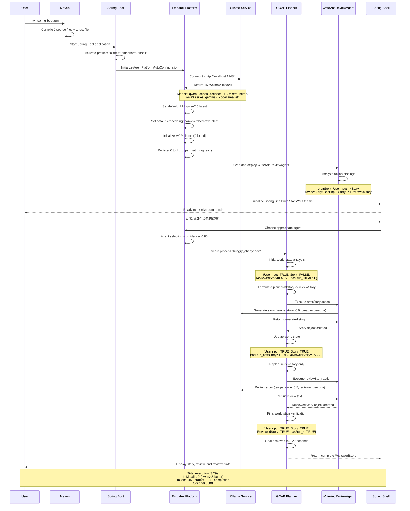

&nbsp;&nbsp;&nbsp;&nbsp;

&nbsp;&nbsp;&nbsp;&nbsp;

# Generated agent

Java agent repository generated by the Embabel project creator.

Starting point for your own agent development using the [Embabel framework](https://github.com/embabel/embabel-agent).

Add your magic here!

Illustrates:

- A simple agent
- Unit tests for an agent verifying prompts and hyperparameters

# To run

Run the shell script to start Embabel under Spring Shell:

```bash
mvn spring-boot:run
```

There is a single example agent, `WriteAndReviewAgent`.
It uses one LLM with a high temperature and creative persona to write a story based on your input,
then another LLM with a low temperature and different persona to review the story.

When the Embabel shell comes up, use the story agent like this:

```
x "Tell me a story about...[your topic]"
```

## Complete Workflow Sequence

This diagram shows the complete end-to-end workflow from system startup to story generation using GOAP dynamic planning:



### Key Features

- **GOAP Dynamic Planning**: Plans and replans actions based on current world state
- **Multi-Persona LLM**: Uses different personas and temperatures for creative vs. analytical tasks  
- **Automatic Agent Selection**: Chooses appropriate agent based on user input
- **State Management**: Tracks execution state and available objects throughout workflow
- **Tool Integration**: Extensible tool system with 6 registered tool groups


